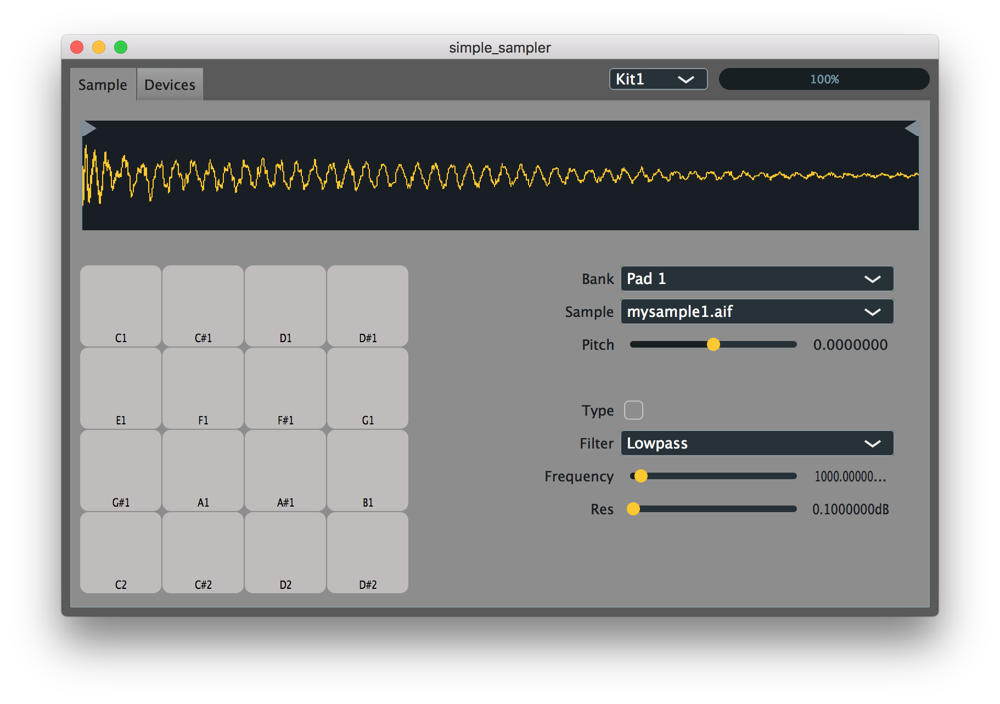

# Simple Sampler (Drum rack clone)

The goal of this project is to reproduce a drum sampler with the JUCE framework. Specifically, I would like to program something similar to the drum rack of Ableton Live.

As compared with the ableton drum rack, I would like to obtain a free Raspberry-pi3 standalone program. With a simple MIDI device plug to the Pi3, I expect to be able to obtain a cheap, portable drum sampler....no screen, no mouse, no keyboard...just a Pi3 and a midi device)

## Demo

## Expected Functionalities

* Standalone Drum Sampler with the following control for each sample
    * Pitch / Detune
    * Filter (LP, BP, HP)
    * Playback Start and end parameters
    * Fade In / Fade out

If you're interested by this project, don't hesitate to contribute or to contact me
